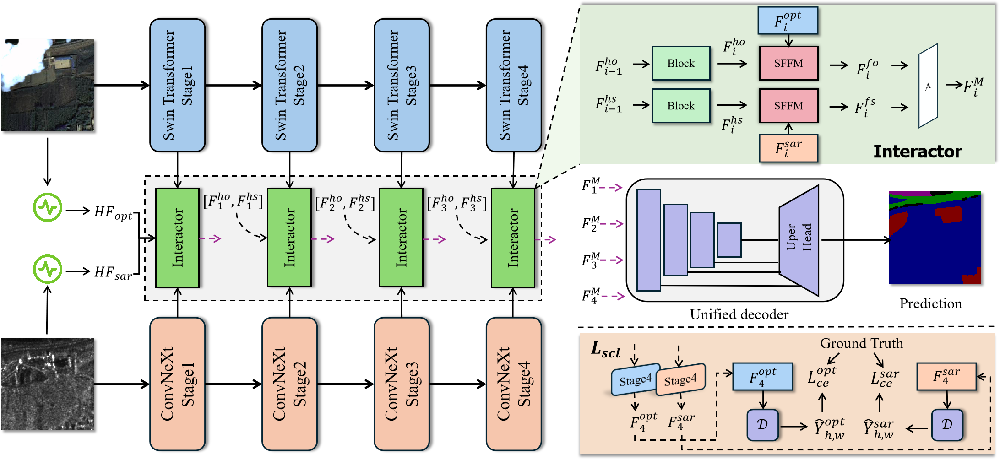

# WHFNet

<div align="center">

**WHFNet: A Wavelet-Driven Heterogeneous Fusion Network for High-Frequency Enhanced Optical-SAR Remote Sensing Segmentation**

**by Bo Ren, Qianfang Wang, Bo Liu, Biao Hou, Chen Yang, Licheng Jiao**

[](LICENSE)



*Figure 1. The overall architecture of the proposed WHFNet.*

</div>

## Abstract

Synergizing the visual richness of optical imagery with the structural robustness of SAR is pivotal for land cover classification. However, the inherent heterogeneity and distinct data distributions between these active and passive modalities often lead to "negative transfer", where valuable modality-specific information is mixed during fusion. To overcome these limitations, this paper proposes a wavelet-driven heterogeneous fusion network (WHFNet) for co-registered optical and SAR images. Unlike normally symmetric architectures, WHFNet adopts a decoupled heterogeneous encoding strategy, leveraging the distinct inductive biases of Transformers and CNNs to preserve independent semantic representations. To bridge the modality gap, we introduce a cross-modal interactor (CMI) grounded in the 2D discrete wavelet transform. This module explicitly injects high-frequency information into spatial features, enhancing the representation of details. Furthermore, a spatial-frequency fusion module (SFFM) is devised to dynamically calibrate the discrepancies between modalities via subtraction operation, while a structural consistency constraint promotes semantically aligned predictions across modalities. Extensive experiments on four benchmark datasets (Xi’an, Pohang, WHU-OPT-SAR, and PIE-RGB-SAR) demonstrate that WHFNet establishes new state-of-the-art performance. Notably, it achieves substantial accuracy gains, particularly improving mIoU by 1.25% on the cloudless WHU-OPT-SAR dataset and 0.92% on the high-precision Xi’an dataset.

## How to RUN?

### Environment

1. Requirements

* Python 3.8
* torch 2.4.1+cu118
* CUDA 11.8 or higher

2. Install all dependencies.

```bash
# pip install -r requirements.txt

# Install OpenMMLab dependencies
pip install -U openmim
mim install mmengine
mim install "mmcv>=2.0.0"
mim install "mmsegmentation>=1.0.0"

# Install other required packages
pip install PyWavelets timm einops
```

### Datasets

1.  Xian and Pohang datasets download links [DDHRNet](https://github.com/XD-MG/DDHRNet/tree/main)
2. [WHU-OPT-SAR](https://github.com/AmberHen/WHU-OPT-SAR-dataset)
3. [PIE-RGB-SAR](https://github.com/whu-pzhang/ASANet)

About the Xian and Pohang datasets, please refer to the [official website](https://github.com/XD-MG/DDHRNet/tree/main) of DDHRNet.

>✨ Release of the Xian, Pohang and Shandong Large-Resolution Datasets, please see Baidu Drive or Google Drive for details in [DDHRNet](https://github.com/XD-MG/DDHRNet).

   


### Training

```bash
# Example for Xian Dataset
CUDA_VISIBLE_DEVICES=0,1 bash tools/dist_train.sh configs/whfnet/whfnet_swin_convnextv2-tiny_2xb4-15k_xian-opt-sar-128x128.py 2

# Example for Korea Dataset
CUDA_VISIBLE_DEVICES=0,1 bash tools/dist_train.sh configs/whfnet/whfnet_swin_convnextv2-tiny_2xb4-40k_korea-opt-sar-256x256.py 2
```

### Evaluation

To evaluate the model, use the following command:

```bash
# Example for Xian Dataset
CUDA_VISIBLE_DEVICES=0,1 bash tools/dist_test.sh configs/whfnet/whfnet_swin_convnextv2-tiny_2xb4-15k_xian-opt-sar-128x128.py <CHECKPOINT_FILE> 2
```

## Citation

If you find this work useful for your research, please cite our paper:

```bibtex
@article{whfnet2026,
  title={WHFNet: A Wavelet-Driven Heterogeneous Fusion Network for High-Frequency Enhanced Optical-SAR Remote Sensing Segmentation},
  journal={IEEE Transactions on Geoscience and Remote Sensing},
  year={2026},
  doi={10.1109/TGRS.2026.3662689}
}
```

If you use DDHR-dataset in your research, please cite the following paper:

```bibtex
@article{ren2022dual,
    title={A dual-stream high resolution network: Deep fusion of GF-2 and GF-3 data for land cover classification},
    author={Ren, Bo and Ma, Shibin and Hou, Biao and Hong, Danfeng and Chanussot, Jocelyn and Wang, Jianlong and Jiao, Licheng},
    journal={International Journal of Applied Earth Observation and Geoinformation},
    volume={112},
    pages={102896},
    year={2022},
    publisher={Elsevier}
}
```

## License

This project is released under the [Apache 2.0 license](LICENSE).

## Acknowledgement
* [MMSegmentation](https://github.com/open-mmlab/mmsegmentation)
* [ASANet (PIE-RGB-SAR)](https://github.com/whu-pzhang/ASANet)
* [DDHRNet](https://github.com/XD-MG/DDHRNet)
* [WHU-OPT-SAR](https://github.com/AmberHen/WHU-OPT-SAR-dataset)
